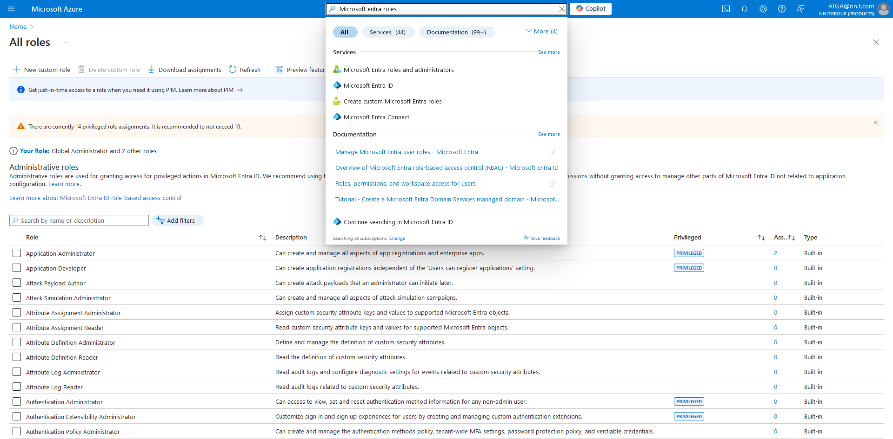
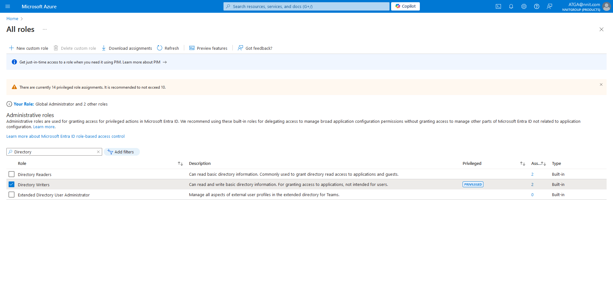
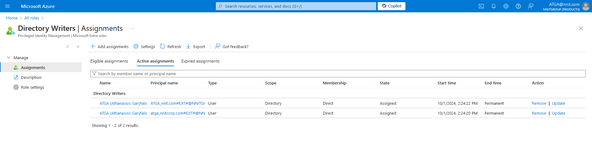
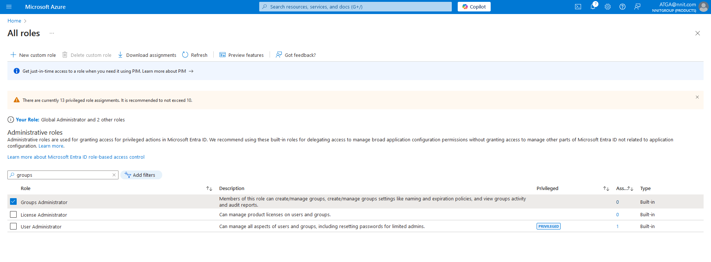
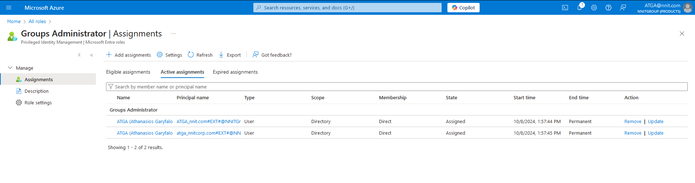
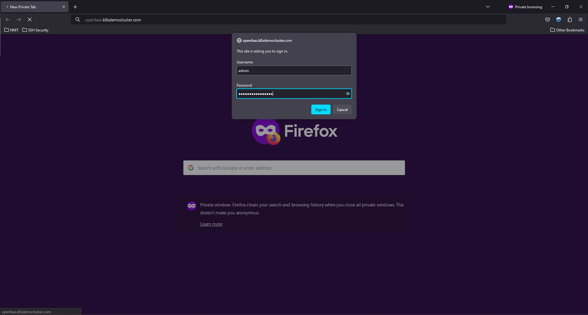

# Project AKS

## Caution, if this is first deployment and the user has not being created prerequisites yet, the user must first navigate to prerequisites directory and apply the code there first.

### List active subscription(s)

The user should list his active subscription(s) and make sure that the default subscription is the one that we want to
use. Sample:

````bash
$ az account list --output table --all
Name                           CloudName    SubscriptionId                        TenantId                              State    IsDefault
---------------------------- ---------- ----------------------------------- ----------------------------------- ------ -----------
<Subscription-Name>          AzureCloud <SubscriptionId>                    <TenantId>                          Enabled  True
````

### Change the active subscription

Because it might not be the default subscription the one that the user wants to use we need to change the subscription.
Sample:

````bash
# change the active subscription using the subscription name
$ az account set --subscription "Subscription-Name"

# change the active subscription using the subscription ID
$ az account set --subscription "xxxxxxxx-xxxx-xxxx-xxxx-xxxxxxxxxxxx"

# verify the default active subscription by using list
$ az account list --query "[?isDefault]"
[
  {
    "cloudName": "AzureCloud",
    "homeTenantId": "<homeTenantId>",
    "id": "<id>",
    "isDefault": true,
    "managedByTenants": [],
    "name": "Subscription-Name",
    "state": "Enabled",
    "tenantId": "<tenantId>",
    "user": {
      "name": "<user>@<email>.COM",
      "type": "user"
    }
  }
]
````

Now the user can use the associated subscription to query, create, update, destroy resources etc etc.

### WSL with terraform

If the user is using WSL(1/2) with terraform, because of the Multi Factor Authenticator (MFA) procedure the following
steps need to be applied. Sample:

````bash
# install wslu on e.g. Ubuntu WSL
sudo apt install wslu -y
# add these two lines to your shell's RC file, e.g. .bashrc or .zshrc.
export DISPLAY=:0
export BROWSER=/usr/bin/wslview
````

Then the user will be able to log in to Azure via terminal e.g. Sample:

````bash
az login --use-device-code

# or directly to a specific tenant (if desired)
az login --use-device-code --tenant <TenantId>
````

### The following steps will assume that prerequisites have being already met.

#### Prerequisites for AKS cluster

#### RBAC

Either the user or service connection needs to have ``Azure Kubernetes Service RBAC Cluster Admin`` RBAC role enabled
before deployment. On this deployment we have enabled RBAC on the cluster that is why.

The user also needs to activate the following Azure RBAC roles if desired to sync AKS with AAD:

- Global Administrator
- Directory Writers
- Groups Administrator

In order to guide through the UI the user needs to navigate to Home -> Privileged Identity Management -> Microsoft Entra
roles

#### Azure-Cli

The user when running the code locally needs also to sign in again through Azure-Cli ``$ sudo az aks install-cli``. More
information can be found at [Azure Kubelogin](https://azure.github.io/kubelogin/install.html).

#### terraform init

Because we want to use different containers in Storage Account per stage (environment) we need to use different init
version file. Sample of code for dev (replace per stage):

````bash
$ tofu -chdir=IaCaKs/tf init -upgrade -reconfigure -backend-config=initVersion/version-test.hcl
````

#### terraform plan

Next step the user should plan the infrastructure to be added / created on the desired Resource Group (RG). Since we
want to use different variables per stage we need to have different tfvars files. Sample of code:

````bash
$ tofu -chdir=IaCaKs/tf plan -out=planOutput -var-file=tfvars/test.tfvars
````

#### terraform apply

The user needs to review the previous steps in the screen before applying. It is highly important to understand that
terraform will modify the infrastructure based on the plan. Assuming that the resources are according to the desired
output the user can apply the modifications. Sample of code:

````bash
$ tofu -chdir=IaCaKs/tf apply "planOutput"
````

#### terraform destroy

In case that the user wants to **completely destroy all** resources (based on the existing `main.tf` file) it can be
accomplished with the following sample of code:

_First plan (so the user can view what resources will be affected)._

````bash
$ tofu -chdir=IaCaKs/tf plan -destroy -out destroyPlan -var-file=tfvars/test.tfvars
````

_Then apply (no return after this step)._

````bash
$ tofu -chdir=IaCaKs/tf apply "destroyPlan"
````

In case the user decides to destroy a specific resource it can be accomplished by using the ``-target`` flag. Sample:

````bash
$ tofu -chdir=IaCaKs/tf plan -destroy -target module.da_projektet_df -out destroyPlan -var-file=tfvars/test.tfvars
````

#### terraform import

If the user needs to import (already existing resources) please follow the example code below on how to do that:

Sample of error:

````bash
$ tofu -chdir=IaCaKs/tf apply "planOutput"
Acquiring state lock. This may take a few moments...
module.aks_projekt_resource_group.azurerm_resource_group.resource_group: Creating...
╷
│ Error: A resource with the ID "/subscriptions/<subscription-id>/resourceGroups/devdemorg" already exists to be managed via Terraform this resource needs to be imported numbero the State. Please see the resource documentation for "azurerm_resource_group" for more information.
│
│   with module.aks_projekt_resource_group.azurerm_resource_group.resource_group,
│   on .terraform/modules/aks_projekt_resource_group/tf/modules/ResourceGroup/main.tf line 1, in resource "azurerm_resource_group" "resource_group":
│    1: resource "azurerm_resource_group" "resource_group" {
│
╵
Releasing state lock. This may take a few moments...
````

On this example the error is coming from module (
resource) `module.aks_projekt_resource_group.azurerm_resource_group.resource_group`

So the user needs to import the resource(s) at this point. For every resource the user needs to read the official
documentation. On this
example [azurerm_resource_group](https://registry.terraform.io/providers/hashicorp/azurerm/latest/docs/resources/resource_group).

Sample of process:

````bash
$ tofu -chdir=IaCaKs/tf import -var-file=tfvars/test.tfvars module.aks_projekt_resource_group.azurerm_resource_group.resource_group "/subscriptions/5dd4eb6a-9fc8-4def-82e8-625f1852e5de/resourceGroups/devdemorg"
Acquiring state lock. This may take a few moments...
module.aks_projekt_resource_group.azurerm_resource_group.resource_group: Importing from ID "/subscriptions/<subscription-id>/resourceGroups/devdemorg"...
module.aks_projekt_resource_group.azurerm_resource_group.resource_group: Import prepared!
  Prepared azurerm_resource_group for import
module.aks_projekt_resource_group.azurerm_resource_group.resource_group: Refreshing state... [id=/subscriptions/<subscription-id>/resourceGroups/devdemorg]

Import successful!

The resources that were imported are shown above. These resources are now in
your Terraform state and will henceforth be managed by Terraform.

Releasing state lock. This may take a few moments...
````

#### Cloudflare

If the team decides to use Cloudflare as a DNS record provider the user needs to configure the following under the
bashrc file. Sample of code:

````bash
# Grafana configurations
export TF_VAR_MONITORING_BOOTSTRAP_PASSWORD="<my-secret-monitoring-password>"
# Rancher configurations
export TF_VAR_RANCHER_BOOTSTRAP_PASSWORD="<my-secret-rancher-psw>"
# Cloudflare DNS provider configurations
export TF_VAR_CLOUDFLARE_API_KEY="<api-key>"
export TF_VAR_CLOUDFLARE_EMAIL="<email>"
````

*Caution*: do not forget to reload the profile after configurations e.g. `source ~/.bashrc`.

#### Minimal RBAC roles required to create / destroy all resources for this project

The user requires to have the following resources assigned to the user that will create / destroy the resources for the
project:

````bash
Microsoft.Authorization/roleAssignments/write (Subscription level)
Microsoft.Authorization/roleAssignments/delete (Subscription level)
Owner on each Resource Group that the resources will be deployed
Microsoft.Network/publicIPAddresses/read (Subscription level)
Microsoft.Network/publicIPAddresses/write (Subscription level)
Microsoft.Network/publicIPAddresses/delete (Subscription level)
````

*Caution*: since we want to create an Active Directory Group and add users into the groups we need to have a special
permission custom for users and for Service Principals. The official documentation can be found
here [azuread_group/API Permissions](https://registry.terraform.io/providers/hashicorp/azuread/latest/docs/resources/group#api-permissions).
Sample of documentation:

_If using the `assignable_to_role` property, this resource additionally requires
the `RoleManagement.ReadWrite.Directory` application role.
If specifying owners for a group, which are user principals, this resource additionally requires one of the following
application roles: `User.Read.All`, `User.ReadWrite.All`, `Directory.Read.All` or `Directory.ReadWrite.All`.
When authenticated with a user principal, this resource requires one of the following directory
roles: `Groups Administrator`, `User Administrator` or `Global Administrator`._

Official documentation on how to apply the
permissions: [Assign Microsoft Entra roles to users](https://learn.microsoft.com/en-us/entra/identity/role-based-access-control/manage-roles-portal).
Because the documentation is deprecated a bit, the user needs to follow the following steps:

_Microsoft Entra Roles and Administrators_

<p align="center" width="100%">
    
</p>

Next search for the ``Directory`` roles:

<p align="center" width="100%">
    
</p>

Next step assign the user / group for the specific RBAC role:

<p align="center" width="100%">
    
</p>

*Caution*: when the user is planning to update AD Groups through the IaC an extra RBAC role is required. Read below:

````bash
When creating this resource in administrative units exclusively, the role Groups Administrator is required to be scoped
on any administrative unit used.
````

Next search for the ``Groups`` roles:

<p align="center" width="100%">
    
</p>

Last step assign the user / group for the specific RBAC role:

<p align="center" width="100%">
    
</p>

#### Loki

````bash
http://loki-gateway.monitoring.svc.cluster.local:80
http://127.0.0.1:3100/loki/api/v1/push
````

Dashboard ID:

````bash
14055
````

#### Prometheus

Dashboard ID:

````bash
20152
or
315
````

#### Grafana

We decided to use
the [Istio Control Plane Dashboard](https://grafana.com/grafana/dashboards/7645-istio-control-plane-dashboard/).

The variables are defined under helmGrafanaValues. Sample of code:

````bash
dashboardProviders:
  dashboardproviders.yaml:
    apiVersion: 1
    providers:
      - name: 'istio'
        orgId: 1
        folder: 'default'
        type: file
        disableDeletion: false
        editable: true
        options:
          path: /var/lib/grafana/dashboards/istio
      - name: 'prometheus'
        orgId: 1
        folder: 'default'
        type: file
        disableDeletion: false
        editable: true
        options:
          path: /var/lib/grafana/dashboards/prometheus

dashboards:
  istio:
    imported-dashboard-name:
      gnetId: 7645
      revision: 225
      datasource: Prometheus
  prometheus:
    imported-dashboard-name:
      gnetId: 315
      revision: 3
      datasource: Prometheus
````

Get secret:

````bash
kubectl get secret --namespace monitoring grafana -o jsonpath="{.data.admin-password}" --kubeconfig IaCaKs/tf/kube/config | base64 --decode ; echo
````

#### Qdrant

Get API-Key:

````bash
$ kubectl get secret qdrant-apikey --namespace qdrant -o jsonpath="{.data.api-key}" --kubeconfig IaCaKs/tf/kube/config | base64 --decode ; echo
````

#### OpenFaaS CE

What is OpenFaaS, with one word ``OpenFaaS - Serverless Functions Made Simple``. More information the user can find on
the official website: [openfaas](https://docs.openfaas.com/).

Also, a link to the official documentation of Microsoft in regard to OpenFaaS deployment on
ASK [Use OpenFaaS on Azure Kubernetes Service (AKS)](https://learn.microsoft.com/en-us/azure/aks/openfaas). The
automated deployment of this cluster differs a bit as we already have an Ingress Load Balancer, so we do not need to
expose another public IP, but also we have TLS encryption applied through the ``Let's Encrypt`` provider
via ``Cert-Manager`` module.

##### Sample deployed on our own cluster:

First login with username and password provided by the user:

<p align="center" width="100%">
    
</p>

If the credentials are correct the user should see something like this:

<p align="center" width="100%">
    
</p>

##### How to install the cli tool

``faas-cli`` Official documentation with alternative solutions [faas-cli](https://docs.openfaas.com/cli/install/).

Sample of code:

`````bash
$ curl -sSL https://cli.openfaas.com | sudo -E sh
Finding latest version from GitHub
0.16.30
Downloading package https://github.com/openfaas/faas-cli/releases/download/0.16.30/faas-cli as /tmp/faas-cli
Download complete.

Running with sufficient permissions to attempt to move faas-cli to /usr/local/bin
New version of faas-cli installed to /usr/local/bin
Creating alias 'faas' for 'faas-cli'.
  ___                   _____           ____
 / _ \ _ __   ___ _ __ |  ___|_ _  __ _/ ___|
| | | | '_ \ / _ \ '_ \| |_ / _` |/ _` \___ \
| |_| | |_) |  __/ | | |  _| (_| | (_| |___) |
 \___/| .__/ \___|_| |_|_|  \__,_|\__,_|____/
      |_|

CLI:
 commit:  3fd37fba2c4f6633f2d9b3b74d522877ed80e808
 version: 0.16.30
`````

##### Get Credentials:

Retrieve from KV the sensitive information:

````bash
$ kubectl get secret --namespace openfaas basic-auth -o jsonpath="{.data.basic-auth-user}" --kubeconfig IaCaKs/tf/kube/config | base64 --decode ; echo
$ kubectl get secret --namespace openfaas basic-auth -o jsonpath="{.data.basic-auth-password}" --kubeconfig IaCaKs/tf/kube/config | base64 --decode ; echo
````

##### Sample of bash login with cli

Login with Cli:

`````bash
$ echo -n '<my-secret-password-retrieved-earlier>' | faas-cli login -g 'https://<domain-defined-on-the-cluster>' -u admin --password-stdin
Calling the OpenFaaS server to validate the credentials...
credentials saved for admin http://openfaas.example.com
`````

##### Get Credentials AKS:

``by default, this command merges the kubeconfig into ${HOME}/.kube/config for users with admin access``

````bash
az aks get-credentials --resource-group ${RESOURCE_GROUP_NAME} --name ${AKS_NAME} --admin
````

``by default, this command merges the kubeconfig into ${HOME}/.kube/config for users with non admin access``

````bash
az aks get-credentials --resource-group ${RESOURCE_GROUP_NAME} --name ${AKS_NAME}
````

# kubelogin by default will use the kubeconfig from ${KUBECONFIG}. Specify --kubeconfig to override

# this converts to use azurecli login mode

````bash
kubelogin convert-kubeconfig -l azurecli
````

# voila!

`````bash
kubectl get nodes
$ kubectl get nodes
NAME                          STATUS   ROLES    AGE   VERSION
aks-aks-34353727-vmss000000   Ready    <none>   8d    v1.29.7
aks-aks-34353727-vmss000001   Ready    <none>   8d    v1.29.7
aks-aks-34353727-vmss000002   Ready    <none>   8d    v1.29.7
`````

##### Sample of pulling and using templates with the cli

Load Templates:

`````bash
$ faas-cli template pull
Fetch templates from repository: https://github.com/openfaas/templates.git at
2024/07/11 11:05:48 Attempting to expand templates from https://github.com/openfaas/templates.git
2024/07/11 11:05:49 Fetched 18 template(s) : [bun csharp dockerfile go java11 java11-vert-x node node14 node16 node17 node18 node20 php7 php8 python python3 python3-debian ruby] from https://github.com/openfaas/templates.git
`````

List Templates:

````bash
$ faas-cli template store list

NAME                     RECOMMENDED DESCRIPTION        SOURCE
bash-streaming           [x]         openfaas-incubator Bash Streaming template
dockerfile               [x]         openfaas           Classic Dockerfile template
dotnet8-csharp           [x]         openfaas           C# template using WebApplication
golang-middleware        [x]         openfaas           HTTP middleware interface in Go
java11-vert-x            [x]         openfaas           Java 11 Vert.x template
node20                   [x]         openfaas           HTTP-based Node 20 template
php8                     [x]         openfaas           Classic PHP 8 template
python3-http             [x]         openfaas           Python 3 with Flask and HTTP
python3-http-debian      [x]         openfaas           Python 3 with Flask and HTTP based on Debian
ruby-http                [x]         openfaas           Ruby 2.4 HTTP template
cobol                    [ ]         devries            COBOL Template
perl-alpine              [ ]         tmiklas            Perl language template based on Alpine image
powershell-http-template [ ]         openfaas-incubator Powershell Core HTTP Ubuntu:16.04 template
powershell-template      [ ]         openfaas-incubator Powershell Core Ubuntu:16.04 template
quarkus-native           [ ]         pmlopes            Quarkus.io native image template
rust                     [ ]         openfaas-incubator Community Rust template
rust-http                [ ]         openfaas-incubator Community Rust template with HTTP bindings
bun-express              [ ]         openfaas           HTTP-based template using bun
go                       [ ]         openfaas           Legacy Golang template
golang-http              [ ]         openfaas           Request/response style HTTP template
java11                   [ ]         openfaas           Java 11 template
node18                   [ ]         openfaas           HTTP-based Node 18 template
php7                     [ ]         openfaas           Classic PHP 7 template
puppeteer-nodelts        [ ]         alexellis          A puppeteer template for headless Chrome
python3                  [ ]         openfaas           Classic Python 3 template
python3-debian           [ ]         openfaas           Python 3 Debian template
python3-flask            [ ]         openfaas           Python 3 Flask template
python3-flask-debian     [ ]         openfaas           Python 3 Flask template based on Debian
ruby                     [ ]         openfaas           Classic Ruby 2.5 template
````

Choose a template and pull it locally on the OS:

````bash
$ faas-cli template store pull python3-http
Fetch templates from repository: https://github.com/openfaas/python-flask-template at
2024/07/11 11:15:21 Attempting to expand templates from https://github.com/openfaas/python-flask-template
2024/07/11 11:15:21 Fetched 5 template(s) : [python27-flask python3-flask python3-flask-debian python3-http python3-http-debian] from https://github.com/openfaas/python-flask-template
$ faas-cli new --list
Languages available as templates:
- bun
- csharp
- dockerfile
- go
- java11
- java11-vert-x
- node
- node14
- node16
- node17
- node18
- node20
- php7
- php8
- python
- python27-flask
- python3
- python3-debian
- python3-flask
- python3-flask-debian
- python3-http
- python3-http-debian
- ruby
````

##### Tutorial

Docker login:

`````bash
$ echo -n '<my-secret-acr-password>' | docker login <my-acr-repository>.azurecr.io -u <my-secret-username> --password-stdin
WARNING! Your password will be stored unencrypted in /home/<user>/.docker/config.json.
Configure a credential helper to remove this warning. See
https://docs.docker.com/engine/reference/commandline/login/#credential-stores

Login Succeeded
`````

#### Function As A Service (FaaS) with Knative

The module deploys Knative Operator automatically. We followed the official
documentation [Install by using the Knative Operator](https://knative.dev/docs/install/operator/knative-with-operators/).

Steps that we followed:

- [Install the Knative Operator](https://knative.dev/docs/install/operator/knative-with-operators/#install-the-knative-operator)
- [Install Knative Serving](https://knative.dev/docs/install/operator/knative-with-operators/#install-knative-serving)
- [Configure DNS](https://knative.dev/docs/install/operator/knative-with-operators/#configure-dns)
- [Install Knative Eventing](https://knative.dev/docs/install/operator/knative-with-operators/#install-knative-eventing)
    - The user if desired can apply custom
      eventing. [Installing customized Knative Eventing](https://knative.dev/docs/install/operator/knative-with-operators/#installing-customized-knative-eventing)
        - [Overwrite mode](https://knative.dev/docs/install/operator/knative-with-operators/#overwrite-mode)
        - [Append mode](https://knative.dev/docs/install/operator/knative-with-operators/#append-mode)
- [Installing Knative Eventing with event sources](https://knative.dev/docs/install/operator/knative-with-operators/#installing-knative-eventing-with-event-sources)

Once the user has completed the deployment we can follow the documentation and build / push a Dockerfile as for example
Python FaaS sample. As an example we followed the sample of the
tutorial: [Hello World - Python](https://github.com/knative/docs/tree/main/code-samples/serving/hello-world/helloworld-python).

Sample of code:

````bash
$ docker buildx build -t "<my acr repo>.azurecr.io/func" --push .
[+] Building 90.4s (10/10) FINISHED                                                                                                                                                                                          docker:default
 => [internal] load build definition from Dockerfile                                                                                                                                                                                   0.0s
 => => transferring dockerfile: 724B                                                                                                                                                                                                   0.0s
 => [internal] load metadata for docker.io/library/python:3.7-slim                                                                                                                                                                     0.6s
 => [internal] load .dockerignore                                                                                                                                                                                                      0.0s
 => => transferring context: 91B                                                                                                                                                                                                       0.0s
 => [1/4] FROM docker.io/library/python:3.7-slim@sha256:b53f496ca43e5af6994f8e316cf03af31050bf7944e0e4a308ad86c001cf028b                                                                                                               0.0s
 => [internal] load build context                                                                                                                                                                                                      0.0s
 => => transferring context: 60B                                                                                                                                                                                                       0.0s
 => CACHED [2/4] WORKDIR /app                                                                                                                                                                                                          0.0s
 => CACHED [3/4] COPY . ./                                                                                                                                                                                                             0.0s
 => CACHED [4/4] RUN pip install Flask gunicorn                                                                                                                                                                                        0.0s
 => exporting to image                                                                                                                                                                                                                 0.0s
 => => exporting layers                                                                                                                                                                                                                0.0s
 => => writing image sha256:f3950472e76ee4d093505406638e817ddc0dc2bce640dbbb05d7a1d1923bba07                                                                                                                                           0.0s
 => => naming to <my acr repo>.azurecr.io/func                                                                                                                                                                                       0.0s
 => pushing devdemoregistry.azurecr.io/func with docker                                                                                                                                                                               87.8s
 => => pushing layer bde8b3d8937b                                                                                                                                                                                                     19.7s
 => => pushing layer 7006b1475b77                                                                                                                                                                                                      3.2s
 => => pushing layer e335097c3f5e                                                                                                                                                                                                      2.9s
 => => pushing layer b8594deafbe5                                                                                                                                                                                                     18.1s
 => => pushing layer 8a55150afecc                                                                                                                                                                                                      3.6s
 => => pushing layer ad34ffec41dd                                                                                                                                                                                                     57.0s
 => => pushing layer f19cb1e4112d                                                                                                                                                                                                     48.6s
 => => pushing layer d310e774110a                                                                                                                                                                                                     85.5s

 1 warning found (use --debug to expand):
 - JSONArgsRecommended: JSON arguments recommended for CMD to prevent unintended behavior related to OS signals (line 22)
````

After the user pushed the image we can test it locally:

````bash
$ docker run -it --rm --env PORT=8080 -p 8080:8080 --name test <my acr repo>.azurecr.io/func:latest
[2024-07-12 16:42:26 +0000] [1] [INFO] Starting gunicorn 22.0.0
[2024-07-12 16:42:26 +0000] [1] [INFO] Listening at: http://0.0.0.0:8080 (1)
[2024-07-12 16:42:26 +0000] [1] [INFO] Using worker: gthread
[2024-07-12 16:42:26 +0000] [9] [INFO] Booting worker with pid: 9
````

Open another terminal and query towards the localhost:

````bash
$ curl http://localhost:8080
Hello World!
````

Next we can deploy on a running k8s cluster:

````bash
apiVersion: v1
kind: Namespace
metadata:
  labels:
    kubernetes.io/metadata.name: faas
  name: faas
---
apiVersion: v1
kind: Secret
metadata:
  name: acr-secret
  namespace: faas
data:
  .dockerconfigjson: ewoJ...fQp9 # sample of code of base64 encoding .dockerconfigjson file
type: kubernetes.io/dockerconfigjson
---
apiVersion: serving.knative.dev/v1
kind: Service
metadata:
  name: hello
  namespace: faas
spec:
  template:
    spec:
      containers:
        - image: <my acr repo>.azurecr.io/func:latest
          ports:
            - containerPort: 8080
          env:
            - name: TARGET
              value: "World"
      imagePullSecrets:
        - name: acr-secret
---
apiVersion: networking.k8s.io/v1
kind: Ingress
metadata:
  annotations:
    cert-manager.io/cluster-issuer: letsencrypt-prod
    nginx.ingress.kubernetes.io/backend-protocol: HTTP
    nginx.ingress.kubernetes.io/ssl-passthrough: "false"
    nginx.ingress.kubernetes.io/upstream-vhost: hello.faas.svc.cluster.local # <our service name>.<namespace>.svc.cluster.local
  name: faas-ingress
  namespace: faas
spec:
  ingressClassName: nginx
  rules:
    - host: faas.<my custom domain> # hello.example.com
      http:
        paths:
          - backend:
              service:
                name: hello
                port:
                  number: 80
            path: /
            pathType: Prefix
  tls:
    - hosts:
        - faas.<my custom domain> # hello.example.com
      secretName: letsencrypt-hello
````

**Important** We assume that the cluster has auto DNS resolution. If not the user needs to configure manually the DNS.
Example lookup:

````bash
$ host -t a faas.example.com
faas.example.com has address 1.2.3.4
````

Sample of deploying the file:

````bash
$ kubectl apply -f faasIngress.yaml --kubeconfig IaCaKs/tf/kube/config
namespace/faas created
secret/acr-secret created
Warning: Kubernetes default value is insecure, Knative may default this to secure in a future release: spec.template.spec.containers[0].securityContext.allowPrivilegeEscalation, spec.template.spec.containers[0].securityContext.capabilities, spec.template.spec.containers[0].securityContext.runAsNonRoot, spec.template.spec.containers[0].securityContext.seccompProfile
service.serving.knative.dev/hello created
ingress.networking.k8s.io/hello-ingress created
````

Sample of resources under the ``faas`` namespace:

````bash
$ kubectl get all -n faas
NAME                                          READY   STATUS    RESTARTS   AGE
pod/hello-00001-deployment-55c59f5d65-8kmhd   2/2     Running   0          85s

NAME                          TYPE           CLUSTER-IP     EXTERNAL-IP                                          PORT(S)                                              AGE
service/hello                 ExternalName   <none>         kourier-internal.knative-serving.svc.cluster.local   80/TCP                                               3m21s
service/hello-00001           ClusterIP      10.0.167.126   <none>                                               80/TCP,443/TCP                                       3m24s
service/hello-00001-private   ClusterIP      10.0.162.103   <none>                                               80/TCP,443/TCP,9090/TCP,9091/TCP,8022/TCP,8012/TCP   3m24s

NAME                                     READY   UP-TO-DATE   AVAILABLE   AGE
deployment.apps/hello-00001-deployment   1/1     1            1           3m24s

NAME                                                DESIRED   CURRENT   READY   AGE
replicaset.apps/hello-00001-deployment-55c59f5d65   1         1         1       3m25s

NAME                                      LATESTCREATED   LATESTREADY   READY   REASON
configuration.serving.knative.dev/hello   hello-00001     hello-00001   True

NAME                                       CONFIG NAME   GENERATION   READY   REASON   ACTUAL REPLICAS   DESIRED REPLICAS
revision.serving.knative.dev/hello-00001   hello         1            True             1                 1

NAME                              URL                                    READY   REASON
route.serving.knative.dev/hello   http://hello.faas.example.com   True

NAME                                URL                                    LATESTCREATED   LATESTREADY   READY   REASON
service.serving.knative.dev/hello   http://hello.faas.example.com   hello-00001     hello-00001   True
````

Since the user is using custom Container Registry we need to create a secret for the container to be able to pull the
image from the ACR:

````bash
$ kubectl create secret docker-registry acr-secret --namespace faas --docker-server=<my acr repo>.azurecr.io --docker-username=<acr username> --docker-password=<acr password>
secret/acr-secret created
````

Alternatively the user can create the secret based on the ~/.docker/config.json file. More information on the
documentation [Pull an Image from a Private Registry](https://kubernetes.io/docs/tasks/configure-pod-container/pull-image-private-registry/).
Sample of code:

````bash
kubectl create secret generic acr-secret --from-file=.dockerconfigjson="/path/to/.docker/config.json" --type=kubernetes.io/dockerconfigjson -n faas --kubeconfig IaCaKs/tf/kube/config
````

Sample of created secret:

````bash
$ kubectl get secret -n faas
NAME                                 TYPE                             DATA   AGE
acr-secret                           kubernetes.io/dockerconfigjson   1      105m
letsencrypt-hello                    kubernetes.io/tls                2      69m
````

After all these configurations we can test against the cluster:

````bash
$ curl https://hello.<my custom domain> # hello.example.com
Hello World!
````

Sample of deleting the resource:

````bash
$ kubectl delete -f faasIngress.yaml -n faas --kubeconfig IaCaKs/tf/kube/config
Warning: deleting cluster-scoped resources, not scoped to the provided namespace
namespace "faas" deleted
secret "acr-secret" deleted
service.serving.knative.dev "hello" deleted
ingress.networking.k8s.io "hello-ingress" deleted
````

Sample of how to encode the ``~/.docker/config.json``:

````bash
$ cat ~/.docker/config.json | base64
ewoJ...fQp9
````

Sample of how to decode the encoded ``~/.docker/config.json``:

````bash
$ echo -n 'ewoJ...fQp9' | base64 -d
{
        "auths": {
                "<my private acr repository>.azurecr.io": {
                        "auth": "ZGV...ZEo="
                }
        }
}
````

##### Knative FAAS with ISTIO

Very important customisation [Configuring the Knative Serving Operator custom
resource](https://knative.dev/docs/install/operator/configuring-serving-cr/).

We applied the following customization:

````bash
apiVersion: operator.knative.dev/v1beta1
kind: KnativeServing
metadata:
  name: knative-serving
  namespace: knative-serving
spec:
  ingress:
    istio:
      enabled: true
      knative-ingress-gateway:
        selector:
          istio: ingressgateway
  config:
    domain:
      "example.com": ""
    istio:
      external-gateways: |
        - name: knative-external-gateway
          namespace: istio-ingress
          service: istio-ingressgateway.istio-ingress.svc.cluster.local
      local-gateways: |
        - name: knative-local-gateway
          namespace: istio-system
          service: knative-local-gateway.istio-system.svc.cluster.local
````

#### How to install Istioctl

The user can find information on the official
page [Install istioctl](https://istio.io/latest/docs/ops/diagnostic-tools/istioctl/#install-hahahugoshortcode686s2hbhb)

Sample of usage:

````bash
$ istioctl proxy-status
NAME                                                   CLUSTER        CDS        LDS        EDS        RDS        ECDS         ISTIOD                      VERSION
istio-ingressgateway-9cc99c9db-xkt5l.istio-ingress     Kubernetes     SYNCED     SYNCED     SYNCED     SYNCED     NOT SENT     istiod-77d7cbcfdb-gfffq     1.22.2
````

#### Cert-Manager

Independently if we followed the choice to use Ingress or Gateway for the kubernetes cluster if we choose to
use [Cert-Manager](https://cert-manager.io/) and [Let's Encrypt](https://letsencrypt.org/) as a certificate provider (
ACME) we need to be careful on the configurations.

There are two ways to create a valid certificate:

- HTTP01
- DNS01

On this tutorial we will not go very deep in explaining how to install or configure each method as both are documented
here [HTTP01](https://cert-manager.io/docs/configuration/acme/http01/)
and [DNS01](https://cert-manager.io/docs/configuration/acme/dns01/).

The goal of this minor tutorial is to assist in case of troubleshooting.

Minor note, if the user chooses to use [DNS01](https://cert-manager.io/docs/configuration/acme/dns01/)
and [Cloudflare](https://www.cloudflare.com/) as DNS resolver (currently the fastest DNS resolver) the ``API-Token``
secret needs to be created in the same namespace as the Cert-Manager package. More information can be found
here [Cluster Resource Namespace](https://cert-manager.io/v1.3-docs/faq/cluster-resource/). This combination is not
compatible with all DNS vendors, the list can be found
here [Supported DNS01 providers](https://cert-manager.io/docs/configuration/acme/dns01/#supported-dns01-providers).

Sample of the configuration on our scenario:

````bash
$ kubectl get secrets -n cert-manager
NAME                                 TYPE                 DATA   AGE
cloudflare-api-token                 Opaque               1      148m
letsencrypt-prod                     Opaque               1      12m
sh.helm.release.v1.cert-manager.v1   helm.sh/release.v1   1      4h47m
````

##### Troubleshooting Cert-Manager Certificates

The first time that the certificate is populated it takes a bit longer than normal.

Let's assume that the user will create the following Certificate. Sample of code:

````bash
apiVersion: cert-manager.io/v1
kind: Certificate
metadata:
  name: ingress-cert
  namespace: istio-system
spec:
  secretName: ingress-cert
  commonName: example.com
  dnsNames:
    - example.com
  issuerRef:
    kind: ClusterIssuer
    name: letsencrypt-prod
````

For the ``Certificate`` created above we can observe that we have chosen to
use [Kind: ClusterIssuer](https://cert-manager.io/docs/configuration/acme/#configuration). Sample of ClusterIssuer
configurations:

````bash
apiVersion: cert-manager.io/v1
kind: ClusterIssuer
metadata:
  name: letsencrypt-prod
spec:
  acme:
    email: user@example.com
    server: "https://acme-v02.api.letsencrypt.org/directory"
    privateKeySecretRef:
      name: letsencrypt-prod
    solvers:
      - dns01:
          cloudflare:
            email: user@example.com
            apiTokenSecretRef:
              name: cloudflare-api-token
              key: api-token
        selector:
          dnsZones:
            - 'example.com'
            - '*.example.com'
````

So let's assume that the ``ClusterIssuer`` is deployed and the user sees this as an output:

````bash
$ kubectl get ClusterIssuer -n cert-manager
NAME               READY   AGE
letsencrypt-prod   True    35m
````

The problem usually appears when we request to create a ``Certificate``. Sample of a problem:

````bash
$ kubectl get Certificate -n istio-system --kubeconfig IaCaKs/tf/kube/config
NAME           READY   SECRET         AGE
ingress-cert   False    ingress-cert   35m
````

The user needs to look a bit deeper as what could be the problem.

- First Step. Describe the Certificate:

    `````bash
    $ kubectl describe Certificates ingress-cert
    Name:         ingress-cert
    Namespace:    istio-system
    Labels:       <none>
    Annotations:  <none>
    API Version:  cert-manager.io/v1
    Kind:         Certificate
    Metadata:
      Creation Timestamp:  2024-07-19T11:13:11Z
      Generation:          1
      Resource Version:    89781
      UID:                 20cb73d8-1ae4-4f9f-8be4-ff91a2879182
    Spec:
      Common Name:  example.com
      Dns Names:
        example.com
      Issuer Ref:
        Kind:       ClusterIssuer
        Name:       letsencrypt-staging
      Secret Name:  ingress-cert
    Status:
      Conditions:
        Last Transition Time:        2024-07-19T11:13:11Z
        Message:                     Issuing certificate as Secret does not exist
        Observed Generation:         1
        Reason:                      DoesNotExist
        Status:                      True
        Type:                        Issuing
        Last Transition Time:        2024-07-19T11:13:11Z
        Message:                     Issuing certificate as Secret does not exist
        Observed Generation:         1
        Reason:                      DoesNotExist
        Status:                      False
        Type:                        Ready
      Next Private Key Secret Name:  ingress-cert-lbp9g
    Events:
      Type    Reason     Age   From                                       Message
      ----    ------     ----  ----                                       -------
      Normal  Issuing    89s   cert-manager-certificates-trigger          Issuing certificate as Secret does not exist
      Normal  Generated  88s   cert-manager-certificates-key-manager      Stored new private key in temporary Secret resource "ingress-cert-lbp9g"
      Normal  Requested  88s   cert-manager-certificates-request-manager  Created new CertificateRequest resource "ingress-cert-1"
    `````

  Because the information provided above is not enough we need to look a bit deeper.

- Step Two. Check the ``Challenges``:
    ````bash
    $ kubectl get challenges -A --kubeconfig IaCaKs/tf/kube/config
    NAMESPACE     NAME                                  STATE     DOMAIN               AGE
    istio-system  ingress-cert-1-4111614399-331667020   pending   example.com   18s
    ````

  The user needs to describe the Challenge to see more information:

    ````bash
    $ kubectl describe challenges ingress-cert-1-4111614399-331667020 -n istio-system
    Name:         ingress-cert-1-4111614399-331667020
    Namespace:    istio-system
    Labels:       <none>
    Annotations:  <none>
    API Version:  acme.cert-manager.io/v1
    Kind:         Challenge
    Metadata:
      Creation Timestamp:  2024-07-19T11:05:37Z
      Finalizers:
        finalizer.acme.cert-manager.io
      Generation:  1
      Owner References:
        API Version:           acme.cert-manager.io/v1
        Block Owner Deletion:  true
        Controller:            true
        Kind:                  Order
        Name:                  ingress-cert-1-4111614399
        UID:                   7d40ce8f-e619-4915-9363-5f13ee73afbc
      Resource Version:        85063
      UID:                     dccce07e-407e-476a-be83-983cf0b22931
    Spec:
      Authorization URL:  https://acme-staging-v02.api.letsencrypt.org/acme/authz-v3/13222595573
      Dns Name:           example.com
      Issuer Ref:
        Kind:  ClusterIssuer
        Name:  letsencrypt-staging
      Key:     <key>
      Solver:
        dns01:
          Cloudflare:
            API Token Secret Ref:
              Key:   api-token
              Name:  cloudflare-api-token
            Email:   <email@example.com>
        Selector:
          Dns Zones:
            example.com
            *.example.com
      Token:     <token>
      Type:      DNS-01
      URL:       https://acme-staging-v02.api.letsencrypt.org/acme/chall-v3/13222595573/V65sIQ
      Wildcard:  false
    Status:
      Presented:   false
      Processing:  true
      Reason:      error getting cloudflare secret: secrets "cloudflare-api-token" not found
      State:       pending
    Events:
      Type     Reason        Age                From                     Message
      ----     ------        ----               ----                     -------
      Normal   Started       99s                cert-manager-challenges  Challenge scheduled for processing
      Warning  PresentError  34s (x5 over 99s)  cert-manager-challenges  Error presenting challenge: error getting cloudflare secret: secrets "cloudflare-api-token" not found
    ````

  From the error above we can clearly see that the ``Certificate`` can not find the ``Cloudflare Token``.

#### Enable debug on Istio POD:

````bash
istioctl proxy-config log pod/istio-ingressgateway-9cc99c9db-nfhgq --level=debug -n istio-ingress
````

Hope this helps other to troubleshoot. More information can be found on the official
documentation [Troubleshooting](https://cert-manager.io/docs/troubleshooting/).

#### Get Data for GitHub Actions Workflow

##### KUBERNETES_URL

Example of command and output:

`````bash
$ kubectl config view --minify -o 'jsonpath={.clusters[0].cluster.server}' ; echo
https://demo-prod-aks-ms6y9f2t.hcp.westeurope.azmk8s.io:443
`````

*Caution*: the user needs to apply the `githubActionsPrerequicites.yaml` file under the deploymentSamples dir. The file
configures the GitHub Actions permissions and configurations for the cluster.

Sample on how to apply the file:

````bash
$ kubectl apply -f IaCaKs/tf/deploymentSamples/githubActionsPrerequicites.yaml
serviceaccount/github-actions created
clusterrole.rbac.authorization.k8s.io/cicd created
clusterrolebinding.rbac.authorization.k8s.io/cicd-getactions created
secret/github-actions-token created
````

##### KUBERNETES_SECRET

To get the token created from the service account the user needs to apply:

````bash
kubectl get secret github-actions-token -n ${NAMESPACE} -o yaml # we use the default namespace if choose different namespace adjust accordingly
````

Copy the whole YAML output and add it as the mentioned repository secret.

### Temporary Documentation

# Azure Kubernetes Service Get-Credentials

### WSL

The user needs to log in to Azure via terminal e.g. Sample:

```bash
az login --use-device-code

# or directly to a specific tenant (if desired)
az login --use-device-code --tenant <TenantId>
```

### List active subscription(s)

The user should list his active subscription(s) and make sure that the default subscription is the one that we want to
use. Sample:

```bash
$ az account list --output table --all
Name                     CloudName    SubscriptionId                        TenantId                              State     IsDefault
-----------------------  -----------  ------------------------------------  ------------------------------------  --------  -----------
<my project> - Prod       AzureCloud   < SubscriptionId >                    < TenantId >                          Enabled   True
<my project> - UAT        AzureCloud   < SubscriptionId >                    < TenantId >                          Enabled   False
<my project> - EDU        AzureCloud   < SubscriptionId >                    < TenantId >                          Enabled   False
<my project> - SIT        AzureCloud   < SubscriptionId >                    < TenantId >                          Enabled   False
<my project> - DEV        AzureCloud   < SubscriptionId >                    < TenantId >                          Enabled   False
```

### Change the active subscription

Because it might not be the default subscription the one that the user wants to use we need to change the subscription.
Sample:

```bash
# change the active subscription using the subscription name
$ az account set --subscription "Sample - DEV"

# change the active subscription using the subscription ID
$ az account set --subscription "xxxxxxxx-xxxx-xxxx-xxxx-xxxxxxxxxxxx"

# verify the default active subscription by using list
$ az account list --query "[?isDefault]" --all
```

### Kubectl Package

The Kubernetes-ctl tool (AKA kubectl), allows you to run commands towards any Kubernetes cluster(s).

The official documentation on how to install kubectl on different Operating Systems can be found
here [Set up Kubernetes tools on your computer](https://kubernetes.io/docs/tasks/tools/).

We will focus on Ubuntu WSL as this is the recommended environment for development on a company computer.

There are different ways on how to install the kubectl package and can be found
here [Install kubectl on Linux](https://kubernetes.io/docs/tasks/tools/install-kubectl-linux/#install-kubectl-on-linux).

We will focus on how to install and configure the package through native package management. Official documentation can
be found
here [Install using native package management](https://kubernetes.io/docs/tasks/tools/install-kubectl-linux/#install-using-native-package-management).

### Compatibility between kubectl client and server:

It is **very** important the user to run client and server almost on the same version. The packages can differ by minor
release difference(s) but not major.

For example today that the tutorial was updated (11/10/2024) the latest __kubectl__ client was on version ``v1.31.4``.

We can check the version through the following command ``kubectl version --client``. Sample:

````bash
$ kubectl version --client
Client Version: v1.31.1
Kustomize Version: v5.4.2
````

On our case we have a k8s cluster with version ``1.29.7``. In order to align the version and install an older version
we need to configure the internal kubectl (on our computer) to be compatible with the server. On this occasion we need
to (downgrade) the version. As a first step we need to configure the kubectl repo. Sample:

````bash
$ curl -fsSL https://pkgs.k8s.io/core:/stable:/v1.29/deb/Release.key | sudo gpg --dearmor -o /etc/apt/keyrings/kubernetes-apt-keyring.gpg
File '/etc/apt/keyrings/kubernetes-apt-keyring.gpg' exists. Overwrite? (y/N) y
````

Next we need to add the appropriate Kubernetes apt repository. Sample of code:

````bash
$ echo 'deb [signed-by=/etc/apt/keyrings/kubernetes-apt-keyring.gpg] https://pkgs.k8s.io/core:/stable:/v1.29/deb/ /' | sudo tee /etc/apt/sources.list.d/kubernetes.list
deb [signed-by=/etc/apt/keyrings/kubernetes-apt-keyring.gpg] https://pkgs.k8s.io/core:/stable:/v1.29/deb/ /
````

Update apt package index, then install kubectl:

````bash
sudo apt-get update
````

List all available packages so we can install the correct one. Sample of code:

`````bash
$ sudo apt list --all-versions kubectl
Listing... Done
kubectl/unknown 1.29.9-1.1 amd64
kubectl/unknown 1.29.8-1.1 amd64
kubectl/unknown 1.29.7-1.1 amd64
.
.
.
kubectl/unknown 1.29.0-1.1 amd64

kubectl/unknown 1.29.9-1.1 arm64
.
.
.
kubectl/unknown 1.29.0-1.1 arm64

kubectl/unknown 1.29.9-1.1 ppc64el
.
.
.
kubectl/unknown 1.29.0-1.1 ppc64el

kubectl/unknown 1.29.9-1.1 s390x
.
.
.
kubectl/unknown 1.29.0-1.1 s390x
`````

Because of the reason that we mentioned earlier we need to install the correct version of kubectl client. Sample of
code:

````bash
$ sudo apt install kubectl=1.29.7-1.1 -y
Reading package lists... Done
Building dependency tree... Done
Reading state information... Done
The following NEW packages will be installed:
  kubectl
0 upgraded, 1 newly installed, 0 to remove and 0 not upgraded.
Need to get 10.6 MB of archives.
After this operation, 50.3 MB of additional disk space will be used.
Get:1 https://prod-cdn.packages.k8s.io/repositories/isv:/kubernetes:/core:/stable:/v1.29/deb  kubectl 1.29.7-1.1 [10.6 MB]
Fetched 10.6 MB in 5s (2167 kB/s)
Selecting previously unselected package kubectl.
(Reading database ... 158020 files and directories currently installed.)
Preparing to unpack .../kubectl_1.29.7-1.1_amd64.deb ...
Unpacking kubectl (1.29.7-1.1) ...
Setting up kubectl (1.29.7-1.1) ...
````

As a next step we need to lock the package, so we will prevent it from getting upgraded. Sample of code:

````bash
$ sudo apt-mark hold kubectl
kubectl set on hold.
````

Next the user needs to make a symbolic soft link to ``kubectl`` package with the expected location for ``az cli``.
Sample of
code:

`````bash
$ sudo ln -s /usr/bin/kubectl /usr/local/bin/kubectl
# verify new soft link
$ ls -la /usr/local/bin
total 74192
drwxr-xr-x  2 root root     4096 Oct 11 16:03 .
drwxr-xr-x 10 root root     4096 Sep 30 16:55 ..
lrwxrwxrwx  1 root root       16 Oct 11 16:03 kubectl -> /usr/bin/kubectl
`````

Next we need to install ``kubelogin`` package. Official documentation can be found
here [Azure Kubelogin](https://azure.github.io/kubelogin/).

Sample of installing ``kubelogin`` package with the ``az cli``.

````bash
$ sudo az aks install-cli --client-version v1.29.7
The detected architecture of current device is "x86_64", and the binary for "amd64" will be downloaded. If the detection is wrong, please download and install the binary corresponding to the appropriate architecture.
Downloading client to "/usr/local/bin/kubectl" from "https://storage.googleapis.com/kubernetes-release/release/v1.29.7/bin/linux/amd64/kubectl"
Please ensure that /usr/local/bin is in your search PATH, so the `kubectl` command can be found.
No version specified, will get the latest version of kubelogin from "https://api.github.com/repos/Azure/kubelogin/releases/latest"
Downloading client to "/tmp/tmp2xzz036s/kubelogin.zip" from "https://github.com/Azure/kubelogin/releases/download/v0.1.4/kubelogin.zip"
Moving binary to "/usr/local/bin/kubelogin" from "/tmp/tmp2xzz036s/bin/linux_amd64/kubelogin"
Please ensure that /usr/local/bin is in your search PATH, so the `kubelogin` command can be found.
````

#### Get Credentials AKS

By default, this command merges the kubeconfig into ${HOME}/.kube/config for users with admin access

````bash
az aks get-credentials --resource-group ${RESOURCE_GROUP_NAME} --name ${AKS_NAME} --admin
````

By default, this command merges the kubeconfig into ${HOME}/.kube/config for users with non admin access

````bash
az aks get-credentials --resource-group ${RESOURCE_GROUP_NAME} --name ${AKS_NAME}
````

kubelogin by default will use the kubeconfig from ${KUBECONFIG}. Specify --kubeconfig to override this converts to use
`azurecli` login mode

````bash
kubectl get all -n monitoring --kubeconfig IaCaKs/tf/kube/config
````

# voila!

Sample of code:

````bash
$ az aks get-credentials --resource-group ${RESOURCE_GROUP_NAME} --name ${AKS_NAME}
A different object named ${AKS_NAME} already exists in your kubeconfig file.
Overwrite? (y/n): y
A different object named ${AKS_NAME} already exists in your kubeconfig file.
Overwrite? (y/n): y
Merged "${AKS_NAME}" as current context in /home/<user>/.kube/config
````

Next try to log in to the cluster (user might be prompt to log in due to first time log in to cluster):

````bash
$ kubectl version
Client Version: v1.29.7
Kustomize Version: v5.0.4-0.20230601165947-6ce0bf390ce3
Server Version: v1.29.7
````

#### Important Requirements

The requirements are the following:

- TF installed
- docker daemon running
- The user which will be used to create the resources should have enough permissions (sample as owner or custom RBAC
  role) to create / assign README access on the Subscription level and also Resource Group level. More information can
  be found on the Microsoft
  forum [Can't deploy Azure Open AI models due "No quota is available for this deployment. You can request for more quota."](https://learn.microsoft.com/en-us/answers/questions/1339528/cant-deploy-azure-open-ai-models-due-no-quota-is-a)
